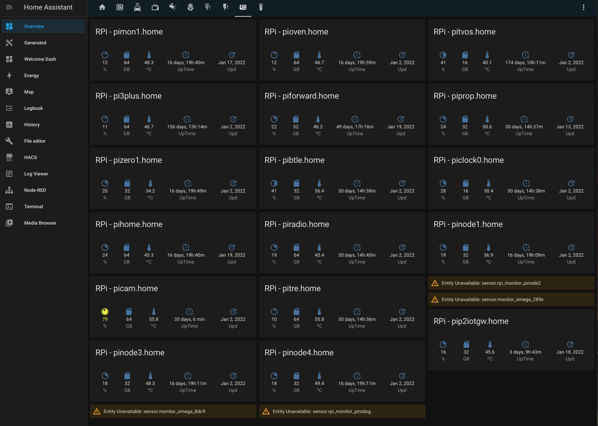
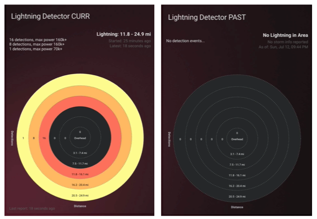
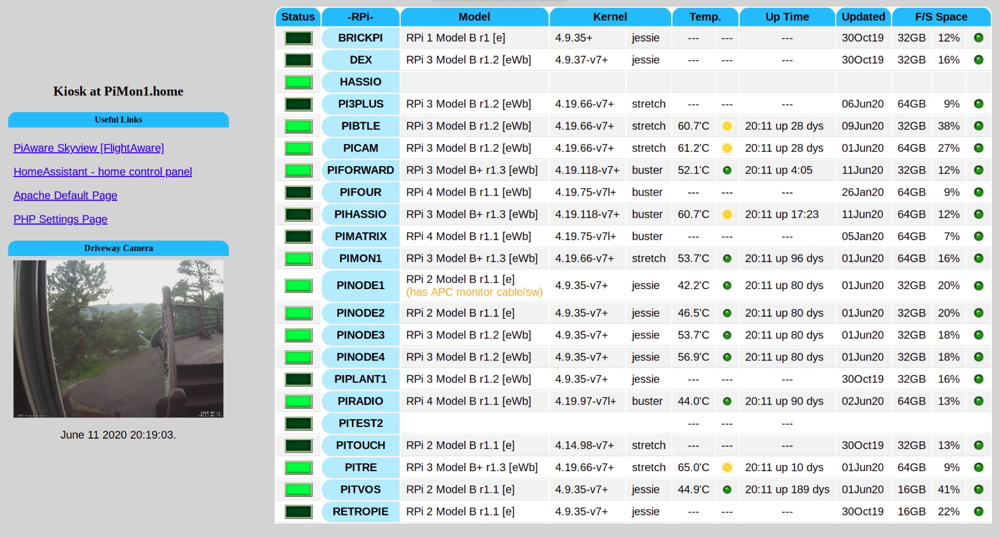

# P2 RPi ioT Gateway - Authors' Prior RPi Work

Enable an RPi to serve as an ioT gateway for our P2 Hardware - while dedicating only 2 pins for serial communication

![Project Maintenance][maintenance-shield]

[![License][license-shield]](LICENSE)

## Prior RPI Projects of mine

### Projects related to the P2

When the P2 D2 was being discussed I started doing reseach early so we'd have a leg up on what RPi interfaces would be available to/from the P2D2 since it could be directly connected to the RPi GPIO header.

- [RPi P2D2 Support](https://github.com/ironsheep/RPi-P2D2-Support) - the documentation of my findings is presented in this repo

This is a fun starting reference for Interfacing with the RPi.

### Projects for Home Assistant

I have four relatively well accepted open-source projects I've done supporting [Home Assistant](https://www.home-assistant.io/) the open source home control platform.

- A dashboard display card for a RPi
- The reporting Daemon that runs on a RPi
- A Lightning Detector card
- A detection reporting daemon that runs on a RPi

#### Monitoring My Raspberry Pi "Farm"

I have a few RPis that I do various projects with. They need monitoring for running out of disk space, needing updates, over temperature, etc. this dashboard provides all of that.

- [Lovelace RPi Monitor Card](https://github.com/ironsheep/lovelace-rpi-monitor-card) - this is the Repo for the card itself (install via HACS)
- [RPi Reporter MQTT -> HA Daemon](https://github.com/ironsheep/RPi-Reporter-MQTT2HA-Daemon) - this is project run on each RPi to report it's details every boot and at fixed intervals

#### Detecting Lightning in my area

I'm a Licensed Amateur Radio Operator. I want to protect my Radios from lightning and when I found the Franklin Lightning Sensor IC AS3935 [Amazon](https://www.amazon.com/SparkFun-Lightning-Detector-AS3935/dp/B07WFKWGC8) on a small board this became my next RPi project.  It turned into a display card for Home Assistant along with a reporting daemon running on the RPi.

- [Lovelace Lightning Detector Card](https://github.com/ironsheep/lovelace-lightning-detector-card) - this is the Repo for the card itself (install via HACS)
- [Lightning Detector MQTT -> HA Daemon](https://github.com/ironsheep/lightning-detector-MQTT2HA-Daemon) - monitor the AS3935 Lightning Detector attached to the RPi and report detection information to the MQTT broker
- [Lightning Detector Theory of Operations](https://github.com/ironsheep/lightning-detector-MQTT2HA-Daemon/blob/master/THEOPS.md) - An explanation of how this all works and my design decisions

Here are a couple *videos* showing the card in action:

- [Storm passing nearby](https://youtu.be/JqDANkaNPYQ) - youtube
- [Storm passing overhead](https://youtu.be/8p5WBOeDCfc) - youtube

### My Earlier Dashboard project

My first attempt at a dashboard was a mix of HTML/PHP web page and supporting scripts that ran on each RPi along with an RPi dedicated to being the dashboard Kiosk.

- [RPi (Dashboard) Scripts](https://github.com/ironsheep/RPi-scripts) - this is the Repo for the older dashboard

### ...

---

> If you like my work and/or this has helped you in some way then feel free to help me out for a couple of :coffee:'s or :pizza: slices!
>
>  &nbsp;&nbsp; -OR- &nbsp;&nbsp; [Patreon.com/IronSheep](https://www.patreon.com/IronSheep?fan_landing=true)

---

## Disclaimer and Legal

> *Raspberry Pi* is registered trademark of *Raspberry Pi (Trading) Ltd.*
>
> *Parallax, Propeller Spin, and the Parallax and Propeller Hat logos* are trademarks of Parallax Inc., dba Parallax Semiconductor
>
> This project is a community project not for commercial use.
>
> This project is in no way affiliated with, authorized, maintained, sponsored or endorsed by *Raspberry Pi (Trading) Ltd.* or any of its affiliates or subsidiaries.
>
> Likewise, This project is in no way affiliated with, authorized, maintained, sponsored or endorsed by *Parallax Inc., dba Parallax Semiconductor* or any of its affiliates or subsidiaries.

---

## License

Licensed under the MIT License.

Follow these links for more information:

### [Copyright](copyright) | [License](LICENSE)

[maintenance-shield]: https://img.shields.io/badge/maintainer-stephen%40ironsheep%2ebiz-blue.svg?style=for-the-badge

[marketplace-version]: https://vsmarketplacebadge.apphb.com/version-short/ironsheepproductionsllc.spin2.svg

[marketplace-installs]: https://vsmarketplacebadge.apphb.com/installs-short/ironsheepproductionsllc.spin2.svg

[marketplace-rating]: https://vsmarketplacebadge.apphb.com/rating-short/ironsheepproductionsllc.spin2.svg

[license-shield]: https://img.shields.io/badge/License-MIT-yellow.svg
