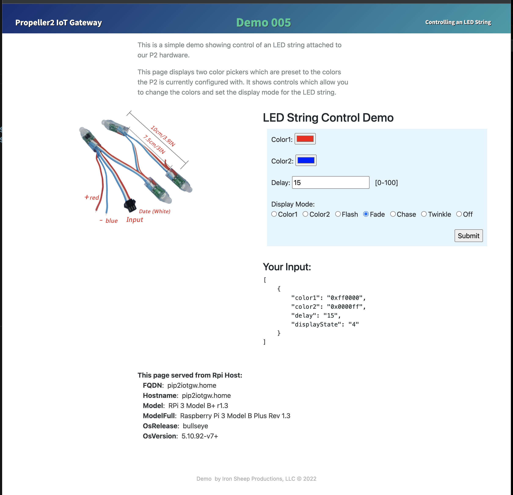

# P2 RPi ioT Gateway - Web: LED-String Control Demo

Enable an RPi to serve as an ioT gateway for our P2 Hardware - while dedicating only 2 pins for serial communication

![Project Maintenance][maintenance-shield]

[![License][license-shield]](LICENSE)

## Files associated with this Demo

This demo consists of a web page to be placed where the RPi web server can find it and a P2 .spin2 file which runs on your P2 hardware connected via serial to your RPi Gateway.

| Spin2/webPage File Name(s) | Demonstration | Form 
| --- | --- | --- |
| [demo\_p2gw\_web_control.spin2](P2-Source/demo_p2gw_web_control.spin2) | Control the String of LED lights from a served web-page | App
| [Archive of Demo Web Page](demoWebPageSets/demoFiles-webCtrl.tar.gz) | String of LED lights - web page shows controls for LED Lights along with details of the RPi host which is running the web server | Web Page Folder 

Once this web page is put into place and the demo is run on the P2 you browse to the web page being presented from the RPi to see the new web control page: 


                                                                                            

## Wiring the LED String

The **demo\_p2gw\_web_control.spin2** program is configured to use P2 pin 16 for the LED string.


**P2 Connections expected by Demo:**

| P2 Purpose | P2 Pin # |
| --- | --- |
| Signal ground | GND near Pin 16|
| LED Serial Data out | 16

Pick a pin on your P2 dev board to be used for LED serial  communications. The demo file provided by this project defines this pin to be 16. Feel free to choose a different pin. Just remember to adjust the constant in your code to use your pin choice.

## Install the Web Control Demo

The .spin2 source for this demo is found in `/opt/P2-RPi-ioT-gateway/P2-Source` You will need to install the web page source under the web server.

Installing is pretty easy. The web-page demo files are also present. They live in `/opt/P2-RPi-ioT-gateway/demoWebPageSets/`.  To unpack this demo file do:

```bash
cd /var/www/html
tar -xzvf /opt/P2-RPi-ioT-gateway/demoWebPageSets/demoFiles-webCtrl.tar.gz
```

This should create a folder `/var/www/html/webCtrl/' which now has a top-level `index.php` page therein.

After these files are unpacked you should be able to point your browser to: `http://{mypihostname|orIpAddress}/webCtrl`

## Run the demo

For this demo you need:

- P2 ready to load code
- P2 wired to RPi (3-wire serial cable)
- LED string wired to the P2 and powered correctly
- RPi running our daemon (by hand or as Daemon from boot)
- Web page unpacked into proper place

### Startup

- Ensure that the Daemon script is running
- Compile and download `demo_p2gw_web_control.spin2` to the P2
  - The demo on startup sends driver status to the RPi 
  - The demo on startup also powers up the LED string with all LEDs set to red
- Open brower to your newly installed web page
  - This page should looks similar to the image above
- Interact with the web page and watch the LEDs do what you command!

### What's the page doing?

The web page is comprised of HTML code styled using CSS (as included files) and has PHP code intermixed with the HTML.

The PHP code loads the values sent from the P2 and uses them as default values for the form it presents.  It also loads details about the host RPi on which it is running and shows these details.

When you adjust the controls on the form, shown on the web page, and then press [Submit] all values you have set are then written into a control file as key-value pairs. The values placed in the file are shown below the form so you can see what's sent.

The P2, when it started up, notified the RPi that it wanted to hear about any changes made to the control file (which the web-page writes to.)

The Daemon sees that the file changed (since the web page just wrote to it), loads the KV pairs from the file and then sends them to the P2.

Lastly the P2 evaluates the change as they arrive and tells the LED string what to change (Color, light pattern, delay, etc.)


This demo should provide a good reference for how you can create similar services. 

You are now controlling your LED String from a web page!

Enjoy!

##  Collections Used by this Demo

**remember:** *collections in gateway parlance are files which contain one or more key-value pairs.*

This demo uses a couple of collections (files) on the RPi. The status file is created when the P2 starts up and sends its initial color values to the RPi. The control file is written whenever the user makes and submits changes on the web page. And lastly, the Proc file is generated automatically whenever the Daemon is run.

Collections used:

| Collection Name | Created By | Description |
| --- | --- | --- |
| STATUS/**p2-ledStatus** | P2 write action | Values to send to web page
| CONTROL/**p2-ledControl** | Web form Submit | Values written by web page, sent to P2 when written
| PROC/**rpiHostInfo** | RPi Daemon | RPi details to be shown on web page

Within the status file the P2 places four key-value pairs:

| Status Variable | Description |
| --- | --- |
|  color1 | The current value for color1
|  color2 | The current value for color2
|  displayMode | The current value identifying which pattern the LEDs are displaying
|  delay | The new value identifying the delay between pattern changes

Whenever the web page is loaded (or reloaded - every N seconds) this file is read, the values for `color1 ` and `color2`are pulled from the file and the color pickers are preset to these values (if they haven't yet been overridden by changing the form pickers.)

When the web page values are changed and submitted it writes the following four key-value pairs:

| Control Variable | Description |
| --- | --- |
|  color1 | The new value for color1
|  color2 | The new value for color2
|  displayMode | The new value identifying which pattern the LEDs should display
|  delay | The new value identifying the delay between pattern changes

Automatically, our Daemon detects this file write and since the P2 has requested to be notified when this file is written, the Daemon then loads this file and sends all four named values to the P2.

Additionally the web page shows content from one of our generated files **PROC/rpiHostInfo** which is maintained by our RPi Daemon and contains details of the RPi upon which the Daemon is running.

##  Tool I used to create the web page

I run on a Mac desktop.  My favorite tool for creating web pages is [Bootstrap Studio](https://bootstrapstudio.io/)  This tool provides easy WYSIWYG editing, easy CSS styling, good responsive layout code, and exports tiney files for you to place on your server.

However, I edit the PHP and make final tweaks to the HTML/CSS by hand. Yes I'm doing all of the "by hand editing" in visual studio.

### ...

---

> If you like my work and/or this has helped you in some way then feel free to help me out for a couple of :coffee:'s or :pizza: slices!
>
> [](https://www.buymeacoffee.com/ironsheep) &nbsp;&nbsp; -OR- &nbsp;&nbsp; [](https://www.patreon.com/IronSheep?fan_landing=true)[Patreon.com/IronSheep](https://www.patreon.com/IronSheep?fan_landing=true)

---

## Disclaimer and Legal

> *Raspberry Pi* is registered trademark of *Raspberry Pi (Trading) Ltd.*
>
> *Parallax, Propeller Spin, and the Parallax and Propeller Hat logos* are trademarks of Parallax Inc., dba Parallax Semiconductor
>
> This project is a community project not for commercial use.
>
> This project is in no way affiliated with, authorized, maintained, sponsored or endorsed by *Raspberry Pi (Trading) Ltd.* or any of its affiliates or subsidiaries.
>
> Likewise, This project is in no way affiliated with, authorized, maintained, sponsored or endorsed by *Parallax Inc., dba Parallax Semiconductor* or any of its affiliates or subsidiaries.

---

## License

Licensed under the MIT License.

Follow these links for more information:

### [Copyright](copyright) | [License](LICENSE)

[maintenance-shield]: https://img.shields.io/badge/maintainer-stephen%40ironsheep%2ebiz-blue.svg?style=for-the-badge

[marketplace-version]: https://vsmarketplacebadge.apphb.com/version-short/ironsheepproductionsllc.spin2.svg

[marketplace-installs]: https://vsmarketplacebadge.apphb.com/installs-short/ironsheepproductionsllc.spin2.svg

[marketplace-rating]: https://vsmarketplacebadge.apphb.com/rating-short/ironsheepproductionsllc.spin2.svg

[license-shield]: https://img.shields.io/badge/License-MIT-yellow.svg
