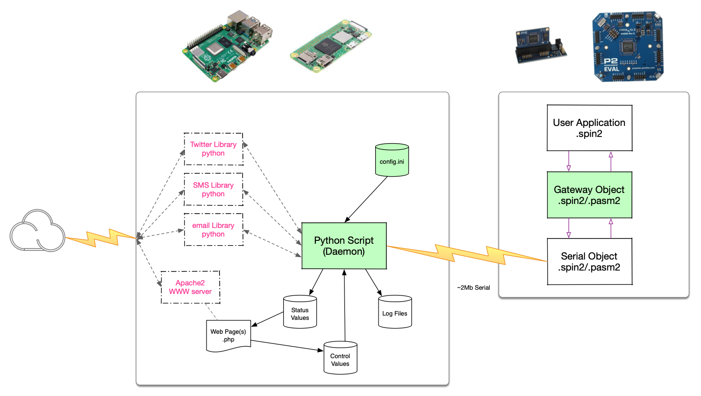

# P2 RPi ioT Gateway

Enable an RPi to serve as an IoT gateway for our P2 Hardware - while dedicating only 2 P2 pins for serial communication and minimal P2 code space

![Project Maintenance][maintenance-shield]

[![License][license-shield]](LICENSE)

## The Project

Provide a Spin2/Pasm2 object to be run on the P2 which communicates over bi-directional serial with a connected Raspberry Pi (RPi) which is in-turn running a python script which handles the requests arriving from the P2.  These requests will provide access to many services which together provide a rich internet-of-things (IoT) capability to our P2.

A custom protocol using service-specific messages is sent over the serial interface between the two devices (P2 and RPi).

## Project Goals

As this project progresses you will be able to find the following here in this repository:

- Full RPi setup and configuration details to get all features of the demo running on your own hardware
- Wiring instructions for the serial communications from the P2 to the RPi
- Configuration instructions for the RPi apache web server
- PHP-based demonstration web page(s) which shows a display of values received from P2 (and maybe even UI controls which can send values to the P2)
- Both the P2 Object and the RPi Python daemon scripts
- Example code will be provided that show each of the services being exercised

### Subgoals

- This project will support use of any model of RPi.  Just select a large enough RPi to do what you need.
- The P2 object developed for the project will be contributed to our community P2 Obex (Object Exchange)

## Table of Contents

On this Page:

- [System Diagram](https://github.com/ironsheep/P2-RPi-ioT-gateway#system-diagram) - quick visual overview
- [Features](https://github.com/ironsheep/P2-RPi-ioT-gateway#features) - survey of capabilities (and tentative future plans)
- [Gateway Services](https://github.com/ironsheep/P2-RPi-ioT-gateway#gateway-services) - Overview of services provided by this gateway
- [DEMOs](https://github.com/ironsheep/P2-RPi-ioT-gateway#demos) - Example files that show how to invoke the various services provided by this gateway

Additional pages:

- [Unbox & setup new RPI](RPI-SETUP.md) - (*if this is your first time or you just want a reminder*)
- [Install Gateway project on RPi](INSTALL.md) w/[Connecting the P2 to the RPi](https://github.com/ironsheep/P2-RPi-ioT-gateway/blob/main/INSTALL.md#wiring-our-serial-connection)
- [Configure Email Service](SETUP-EMAIL.md)
- [Configure Web Server & PHP](SETUP-WEBSERV.md)
- Configure SMS Service - *content TBA*
- Configure Twitter Service - *content TBA*
- and experience I draw from wihile creating this project: [My Prior RPi Efforts](AUTHORS-RPI-WORK.md)

---

## System Diagram



**Figure 1** - [Left to right]: Internet (cloud), RPi (model of your choice) providing connections to the internet, on the right our P2 Development system.

The green areas: **P2 Gateway Object**, The **Python Script** (Daemon) and the **config.ini** file comprise the entire system contributed by this project.  The act of installing and configuring this project on your RPi adds the needed libraries and, if it turns out to be needed, you'll be walked through configuration of the RPi Apache Server.

We use files to communicate between the P2 and the RPi web server so that we can use **directory watching** within the python script so that any control-file changes cause the script to be notified which in-turn then sends the control value changes to the P2.  The web pages are also self refreshing so that they automatically see any status-file changes and updates the page.

The Daemon script can, if so configured, keep logs of activity, keep copies of all email traffic, etc. This can be used as needed to review history of system activity.

## Features

Initially, we envision that this IoT gateway will support the features/services shown in the table below. However, this project is meant to be a gathering place for all such interfacing to the outside connected world. If more serivices are identified as useful then they can and should be added here as the community decides what they want.

| Service Type | Description | Imple. Status |
| ------------ | ----------- | ------------- |
| Email | |
| | P2 asks RPi to send an email message to one or more recipients, providing full/partial content for email | WORKING
| | RPi logs outgoing email from P2 (allowing display on web backend, etc.) | in-progress
| Named Variable Storage ||
| | P2 reads values from file(s) on RPi | WORKING
| | P2 writes values to file(s) on RPi | WORKING
| | P2 can delete own file(s) from RPi | in-progress
| Web Server| |
| | P2 sends values that are shown on a web page served from RPi (using file services)| WORKING
| | P2 Gets values sent from web page to the P2 (controls touched, text entered)| WORKING
| SMS (texting) | |
| | P2 asks RPi to send a text message to the phone number | waiting
| | (Maybe? have to see if possible) P2 gets text message contents relayed from RPi | waiting

### Upcoming/Possible Feature Additions

| Service Type  | Description |
| ------------- | ----------- |
| Twitter | |
| | P2 asks RPi to send a message to a Twitter account
| | P2 gets Twitter message contents relayed from RPi
| | RPi collects Twitter feed content into file allowing it to be accessed later by P2 or RPI web page
| MQTT Operations |
|| P2 sends values which are then forwarded within topic to MQTT Broker
|| Monitor topic for control / configuration changes - report these to P2
| HA via MQTT Operations | -- support for [Home Assistant](https://www.home-assistant.io/) --
|| Announce hardware status value types to service (*Enables HA Discovery*)
|| P2 sends values which are then forwarded within topic to MQTT Broker
|| Monitor topic for control / configuration changes - report these to P2

## Gateway Services

This IoT gateway is intended to provide, with very little P2 resource use, full connectivity to the Internet.

It does this by providing a collection of independent services.  This section presents each service and introduces the service  capabilties.

Each unique service requires setup on the RPi before use. All configuration details (names, api-keys, etc.) are maintained in a gateway **config.ini** file installed with the gateway software on the RPI.  Only the service(s) you wish to use need to be configured.  The config.ini contains a named section for each service type.  Installation and configuration details found on our [Installation Page](INSTALL.md)

### Email Send

The email service allows the P2 to send email text messages.  Attachments may be added later.
With simple method call in spin the user identifies the email addressee, the subject and the body text of the email to be sent.

*IDEA: does your P2 project need a way to tell you significant status changes or test results?  Have it send an email to you!*

### Key-Value Storage Operations

We want our P2 to be able to save and restore configuration settings for your application. We also want it to be able to send values to be displayed on the RPi web page backend. We also want to be able to influence our P2 behaviors by interacting with a web-page on our RPi. As we interact with the web page, we want the new values to be automatically sent the the P2.

Example key-value (KV) pairs:

- `ledColor`=`0x456621`
- `tempStr`=`"51 F"`
- `helloStr`=`"Hi there from our P2!"`

To facilitate this, we use **Key-Value (KV) Storage Operations** which can be thought of as being a subset of file operations. We don't provide a full set of file read/write create/delete operations but we do provide a simplified but similar set of functions sufficient for moving control and status values between the P2 and the rest of the connected world.

KV pairs are stored on the RPi as **named collections**. Named collections do not have a file-type just a name. In reality these are written to the RPi as `{collectionName}.json` files which enables us to add some fun expanded capability in the future.

This table presents our vision of the KV Storage operations we are planning to provide and the status of each:

| KV Storage Op. | Description | Status
| --- | --- | --- |
| Create/Access a named collection of KV pairs | Access a file within a known folder (optionally create it if not present) supports [Read, Write, Listen] Modes - returns a fileID | WORKING
| Write a key value pair to a collection | Given a fileID write a key/value pair to the file (replaces prior value for key if was already in file)| WORKING
| Read a value for a given key from a collection | given a fileID read the value for a given key from the file | WORKING
| Read keys from a collection | given a fileID return all the keys found within the file | WORKING
| Load entire collection | given a fileID return all the key/value pairs found in the file
| Remove a collection | given a fileID remove the file
| Determine if a collection exists | given a folderID and a filename return T/F where T means the file exists
| List named collections within a known folder | given a folderID return a list of file names found in the folder| WORKING
| Get named collection details | given a fileID return details about the file (name, path, size, etc.)
| List known folders | return a list of folderIDs for known folders

**NOTE** the `.json` storage format on the RPi allows us in the future to support lightweight structured data: lists of values (optionally named) and lists of key/value pairs (also optionally named).

#### Known Folders

We are choosing to use known folders rather than provide access to the entire filesystem on the RPi.  This allows us to configure access to these known folders maintaining good security practices on our RPi.

| Folder | Purpose |
| --- | --- |
| TMP | Temporary files written by the P2 which the RPi can delete as it needs to.
| VAR | this is where P2 puts its files which are not web-server related.
| CONTROL | Control files - written by web pages on our RPi. Values are automatically sent to the P2 each time a file appears here or a file here is changed.
| STATUS | Status files - P2 writes files here which will be loaded by web pages.
| LOG | Various log files maintained by the Gateway Daemon.
| MAIL | Any Mail archives are written to here by the Gateway Daemon.
| PROC | /proc like readonly files which provide RPi configuration information.

The actual location within the RPi file system for each of the folders is built into our daemon script but can be overridden in the **config.ini**.

A shell script `mkGwDirs` is provided to create RPi the directories used.

Another shell script `lsGwDirs` is provided to list file contents of the RPi directories without you having to rememeber where they are. Good for listing the files while you are learning where the various folder are.

Example use:

```bash
$ lsGwDirs 
* /tmp/P2-RPi-ioT-gateway:
total 4
-rw-r--r-- 1 pi pi 31 Jan 14 15:23 p2TmpFile.json

* /var/P2-RPi-ioT-gateway:
total 16
drwxrwxr-x 2 daemon users 4096 Jan 11 16:20 control/
drwxrwxr-x 2 daemon users 4096 Jan 11 16:20 mail/
drwxrwxr-x 2 daemon users 4096 Jan 11 16:20 proc/
drwxrwxr-x 2 daemon users 4096 Jan 11 16:20 status/

* /var/P2-RPi-ioT-gateway/control:
total 0

* /var/P2-RPi-ioT-gateway/status:
total 0

* /var/log/P2-RPi-ioT-gateway:
total 0

* /var/P2-RPi-ioT-gateway/mail:
total 0

* /var/P2-RPi-ioT-gateway/proc:
total 0


```

### SMS (Text Messages) Send/Receive

The SMS service allows the P2 to send (*and maybe receive, we'll see as we implement this*) sms / text messages to a specific phone number.   This service also needs the user to create an API Key and record it in the **config.ini** file.

*IDEA: does your P2 project need a way to tell you if something needs attention? Have it text your phone!*

### (*Future*) Twitter Send/Receive

The Twitter service allows the P2 to send Twitter messaages to and receive Twitter message from the configured Twitter account. Access is provided to the Twitter API by using a user specific API Key which you obtain and then place in your **config.ini** file.

*IDEA: Imagine using our LED Matrix display to create a live display of Twitter traffic for a specific account!*

### (*Future*) MQTT Send/Receive

*Coming soon, we hope!*

### (*Future*) Home Assistant via MQTT Send/Receive

*Coming soon, we hope!*

## DEMOs

As we develop the gateway we are working to implement each of the services.  We are releasing the P2 applications that we used to develop these services as **DEMO P2 Apps** and **DEMO, RPi side, web pages**.

We keep a growing list of these DEMOs in this section:

| Spin2/webPage File Name(s) | Demonstration | Form | Status |
| --- | --- | --- | --- |
| [demo\_p2gw_email.spin2](P2-Source/demo_p2gw_email.spin2) | Sending email to one or more users from P2 | App | WORKING
| [demo\_p2gw_filerw.spin2](P2-Source/demo_p2gw_filerw.spin2) | Store named values on our RPi and retrieve them from the RPi | App | WORKING
| [demo\_p2gw_ProcRPi.spin2](P2-Source/demo_p2gw_ProcRPi.spin2) | Display RPi configuration data on our P2 Debug Terminal | App | WORKING
| [DEMO 1-wire from Web Page](DEMO-1-WIRE.md) | Display live 1-wire temp sensor data on a web page | App, Web Page | WORKING
| | Change values on a control web page causing values to be shown in P2 Debug Terminal | App, Web Page |

### Future DEMOs

| Spin2/webPage File Name(s) | Demonstration | Form | Notes |
| --- | --- | --- | --- |
| | Send a "Hello World" text from our P2 to a users phone | App | *Requires SMS API Key*
| | Tweet a message from our P2 | App | *Requires Twitter API Key*
| | Display Twitter feed data on our P2 Debug Terminal | App | *Requires Twitter API Key*

If you an idea for a DEMO you'd like to see here you can do one of two things: 

1. File an Issue *Enhancement Request* and we will consider taking the time to develop and publish it
1. (Preferred) You can develop the Demo, commit it to your fork of this repository and then submit a *Pull Request* so we can then Merge your contribution into this Repository!

---

> If you like my work and/or this has helped you in some way then feel free to help me out for a couple of :coffee:'s or :pizza: slices!
>
> [](https://www.buymeacoffee.com/ironsheep)

---

## Disclaimer and Legal

> *Raspberry Pi* is registered trademark of *Raspberry Pi (Trading) Ltd.*
>
> *Parallax, Propeller Spin, and the Parallax and Propeller Hat logos* are trademarks of Parallax Inc., dba Parallax Semiconductor
>
> This project is a community project not for commercial use.
>
> This project is in no way affiliated with, authorized, maintained, sponsored or endorsed by *Raspberry Pi (Trading) Ltd.* or any of its affiliates or subsidiaries.
>
> Likewise, This project is in no way affiliated with, authorized, maintained, sponsored or endorsed by *Parallax Inc., dba Parallax Semiconductor* or any of its affiliates or subsidiaries.

---

## License

Copyright © 2022 Iron Sheep Productions, LLC. All rights reserved.

Licensed under the MIT License.

Follow these links for more information:

### [Copyright](copyright) | [License](LICENSE)

[maintenance-shield]: https://img.shields.io/badge/maintainer-stephen%40ironsheep%2ebiz-blue.svg?style=for-the-badge

[marketplace-version]: https://vsmarketplacebadge.apphb.com/version-short/ironsheepproductionsllc.spin2.svg

[marketplace-installs]: https://vsmarketplacebadge.apphb.com/installs-short/ironsheepproductionsllc.spin2.svg

[marketplace-rating]: https://vsmarketplacebadge.apphb.com/rating-short/ironsheepproductionsllc.spin2.svg

[license-shield]: https://camo.githubusercontent.com/bc04f96d911ea5f6e3b00e44fc0731ea74c8e1e9/68747470733a2f2f696d672e736869656c64732e696f2f6769746875622f6c6963656e73652f69616e74726963682f746578742d646976696465722d726f772e7376673f7374796c653d666f722d7468652d6261646765
