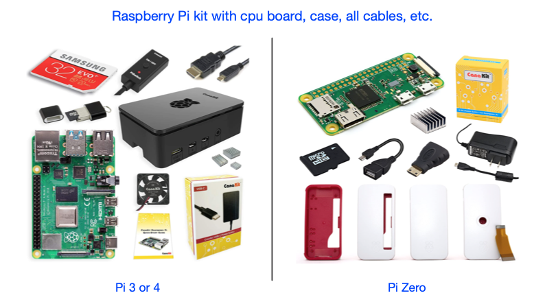

# P2 RPi ioT Gateway - Setting up your 1st Raspberry Pi (RPi)
New to Raspberry Pi? This is your quick-start for setting getting a Raspberry Pi ready to use as a P2 Gateway to the internet!

![Project Maintenance][maintenance-shield]
[![License][license-shield]](LICENSE) 

---

**--------- This project currently UNDER DEVELOPMENT!  it is NOT yet ready for use! ---------**

---

## Raspberry Pi - Setup Overview

When you first open new Raspberry Pi getting it operational for use can be daunting. Where do you start?  This page intends to make this at least a guided effort!

When setting up the new RPi you will be doing:

1. Unbox and place into case, add keyboard and HDMI display
1. Locate and initialize a uSD card with your desired OS
1. Boot the RPi after insterting the uSD card
1. Configure the RPi to join your network
1. Configure services you need 
1. Install the latest software updates (OS, security patches, etc.)
1. DONE. Congratulations! You are ready to use this RPi as a gateway!

## Unbox and place into case, add keyboard, mouse and HDMI display

To start you'll need a Raspberry Pi. I have a fair number of them so here's some hints at how I've learned to acquire mine. First of all I tend to buy kits that have cases. Sometimes the kits with larger uSD cards are more expensive so i'll go for the kits with smaller uSD cards and then I just replace the uSD card with my own.  Here are some example kits ($50 to $150 at Amazon):



I tend to run my RPi's headless, meaning they are network attached (wired or wireless) and then I access them remotely via SSH (command-line) or VNC (remote desktop).  Both of these forms are natively supported by [**Raspberry Pi OS**](https://www.raspberrypi.com/software/operating-systems/) (a debian derivative OS for Rasperry Pi.)  But after initial turn-on you have to enable SSH and VNC before you can connect.  This brings us to the issue of needing, at least temporarily, a display and keyboard w/mouse or touchpad so you can initially configure your new RPi.  Here's what I keep readily avaialable for when I need to turn on a new RPi:


This is a [Logitech k400 series Keyboard with touchpad](https://www.amazon.com/Logitech-Wireless-Keyboard-Touchpad-PC-connected/dp/B014EUQOGK) ~$40 and a something like [7" LCD display with HDMI input](https://www.amazon.com/Loncevon-Portable-Computer-Raspberry-Headphone/dp/B06XQJVXHL) ~$65.  Neighter of these link are what I have since I purchased mine so long ago but these should work if you need to purchase them.


## Locate and initialize a uSD card with your desired OS

Ok, my choice for uSD cards is 32GB for normal use, 64GB if I'm planning generate on the RPi. My other consideration is frequent writing of files (camera or video use.) Then in this case I'll opt for uSD cards that support frequent writing.  Here's a summary:

| Size/Capability | Notes - Why |
|---- | --- |
| 32GB | normal everyday use |
| 64GB | if RPI is generating/collecting data |
| High write count/frequent writes | Ex. if RPi is used as say security cam. |

[Typical 32GB uSD at Amazon](https://www.amazon.com/s?k=32gb+microsd&i=electronics&crid=221J1V0JO07YL&sprefix=32gb+microsd%2Celectronics%2C104&ref=nb_sb_noss) - from $7 ea.

Next we have to load the RPi operating system on to the card. I download the [**Raspberry Pi OS Desktop version**](https://www.raspberrypi.com/software/operating-systems/) as it is smaller but supports full desktop when i use VNC to access the RPi. However, I save download time and uSD space as this doesn't have all the extra desktop applications of the larger version.

Now you'll want to copy the downloaded image to the new uSD card. The Raspberry Pi site offers solutions/tools for doing this from any Operating System you may be working from. To quote their site: [Raspberry Pi Imager](https://www.raspberrypi.com/software/) is the quick and easy way to install an operating system to a microSD card ready to use with your Raspberry Pi.

If you are new to this then I suggest you follow their instructions. 

**HEADS UP!!!** If you are new to all of this please SKIP the next sections headed with **"Reference ONLY..."** as these are for advanced users only!  As a beginner you can skip to the section **[Boot the RPi after insterting the uSD card](https://github.com/ironsheep/P2-RPi-IoT-gateway/blob/main/RPI-SETUP.md#boot-the-rpi-after-insterting-the-usd-card)** after copying the new image to your uSD card.

---

**WARNING** *The following is provided as a detailed reference only.  These are not steps to be followed and are certainly not for use if this is one of your first times doing this!*

### Reference ONLY - My Process

*Please note: this is NOT for the faint-of-heart as one could easily wipe your MAC/Windows boot disk.  When i'm in administrator mode doing this kind of thing i've put away all concerns mentally and I go into a mode where I'm double- and tripple-checking each step i take before I take it. (and just don't attempt this stuff when you are sleepy. Yes, experience is an unforgiving teacher ;-)*

My main desktops are MACs not Windows machines. I actually configure the uSD cards entirely using command line tools from within a term window. As a point of reference here's what I do:

1. Download the image (.zip file)
1. Copy and write the SHA256 integrity hash to a local text file
1. Run a script **chksha** which runs **gsha256sum** to generate the SHA256 sum for the .zip file and compares it to the text file to ensure there is no damage to the file before I unpack it. (they must match before I proceed.)
1. Unzip the image from the now known-good .zip file
1. Copy the .img to the uSD card (I use the [dd(1)](https://man7.org/linux/man-pages/man1/dd.1.html) command)
1. Insert the uSD card into the RPi which is now already in its' case

### Reference ONLY - Example file SHA256 check steps

Let's say I downloaded **2021-10-30-raspios-bullseye-armhf.zip**

Then my .sha file (**2021-10-30-raspios-bullseye-armhf.sha**) contains:

```bash
SHA256 (2021-10-30-raspios-bullseye-armhf.zip) = 6e9faca69564c47702d4564b2b15997b87d60483aceef7905ef20ba63b9c6b2b
```

My **chksha** script:

```bash
#!/bin/bash

SCRIPT=${0##*/}
SCRIPT_VERSION="1.0"

# example:
#   gsha256sum -c 2019-04-08-raspbian-stretch.sha 

FILE_TO_CHECK=$1
if [ ! -f "${FILE_TO_CHECK}" ]; then
	echo "$SCRIPT: ERROR- need \$1 as .sha filename" >&2
	exit 2;
fi

(set -x; gsha256sum -c "${FILE_TO_CHECK}")
exit 0
```

which I run as: 

```bash
$ ./chksha 2021-10-30-raspios-bullseye-armhf.sha
```

---

*ok, now, it is really easy to be impatient here. Let's resist this urge and go through the following steps before we try to install the gateway project.*

## Boot the RPi after insterting the uSD card

Ok, we install the uSD card and we connect display and keyboard and power up the RPi.
At this point we need to make the RPi a good citizen on your network, configure it so it's ready for use and make sure we have the latest security updates and updated sofware packages.

### Configure the RPi to join your network

When you first start your RPi the file system on the SD card will be expanded to take up the entire size of the SD card. The filesystem you copied to this card was smaller intentionally. So the RPi detects this and adjusts the filesystem on the uSD to the size of the card you chose. Now it boots the desktop but you are first prompted to set your locale (*I'm in the USA, in the Denver timezone*) so I choose US Keyboard / layout and choose the Denver timezone. 

After you've answered these questions the system ...

### Configure services you need 

### Install the latest software updates (OS, security patches, etc.)


---

> If you like my work and/or this has helped you in some way then feel free to help me out for a couple of :coffee:'s or :pizza: slices! 
> 
> [](https://www.buymeacoffee.com/ironsheep)

----

## Disclaimer and Legal

> *Raspberry Pi* is registered trademark of *Raspberry Pi (Trading) Ltd.*
>
> *Parallax, Propeller Spin, and the Parallax and Propeller Hat logos* are trademarks of Parallax Inc., dba Parallax Semiconductor
>
> This project is a community project not for commercial use.
> 
> This project is in no way affiliated with, authorized, maintained, sponsored or endorsed by *Raspberry Pi (Trading) Ltd.* or any of its affiliates or subsidiaries.
> 
> Likewise, This project is in no way affiliated with, authorized, maintained, sponsored or endorsed by *Parallax Inc., dba Parallax Semiconductor* or any of its affiliates or subsidiaries.

---

## License

Copyright © 2022 Iron Sheep Productions, LLC. All rights reserved.<br />
Licensed under the MIT License. <br>
<br>
Follow these links for more information:

### [Copyright](copyright) | [License](LICENSE)


[maintenance-shield]: https://img.shields.io/badge/maintainer-stephen%40ironsheep%2ebiz-blue.svg?style=for-the-badge

[marketplace-version]: https://vsmarketplacebadge.apphb.com/version-short/ironsheepproductionsllc.spin2.svg

[marketplace-installs]: https://vsmarketplacebadge.apphb.com/installs-short/ironsheepproductionsllc.spin2.svg

[marketplace-rating]: https://vsmarketplacebadge.apphb.com/rating-short/ironsheepproductionsllc.spin2.svg

[license-shield]: https://camo.githubusercontent.com/bc04f96d911ea5f6e3b00e44fc0731ea74c8e1e9/68747470733a2f2f696d672e736869656c64732e696f2f6769746875622f6c6963656e73652f69616e74726963682f746578742d646976696465722d726f772e7376673f7374796c653d666f722d7468652d6261646765
