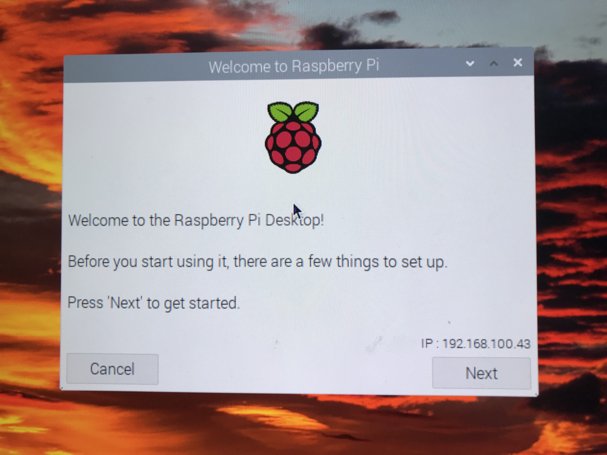
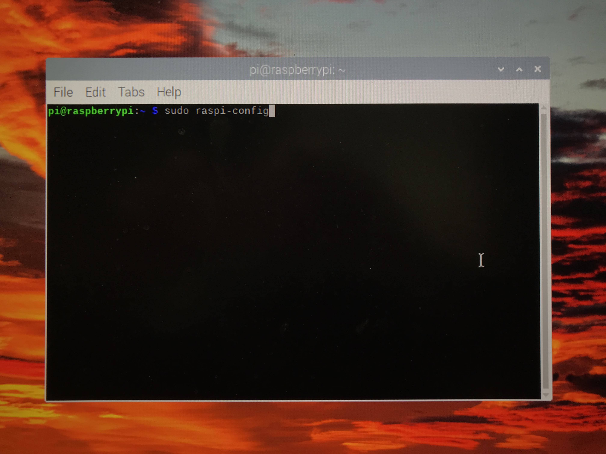
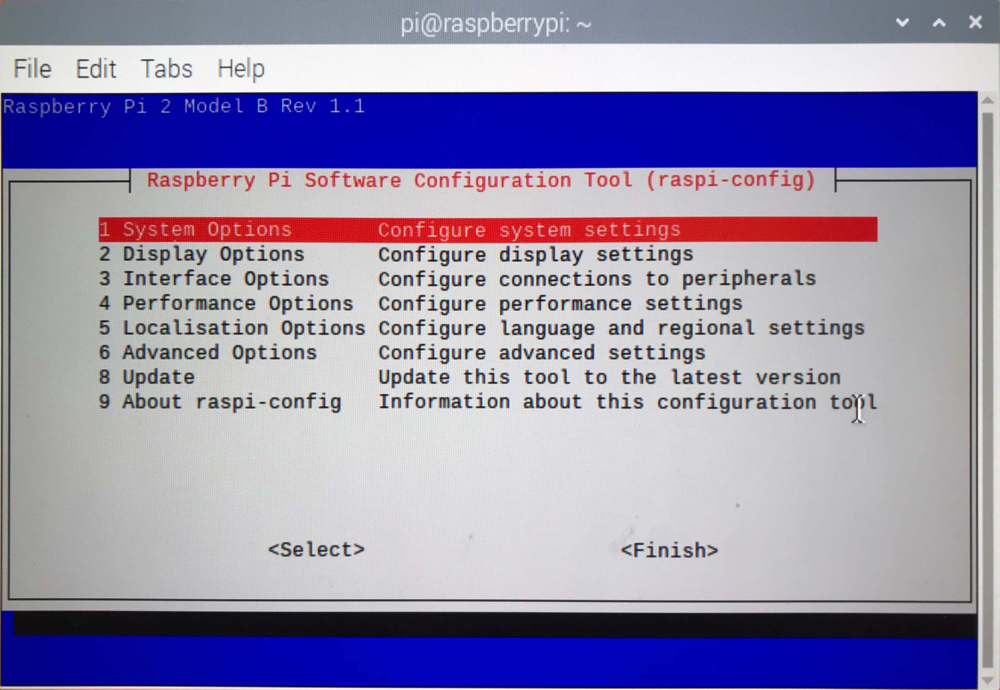

# P2 RPi ioT Gateway - Setting up your 1st Raspberry Pi (RPi)

New to Raspberry Pi? This is your quick-start for setting getting a Raspberry Pi ready to use as a P2 Gateway to the internet!

![Project Maintenance][maintenance-shield]
[![License][license-shield]](LICENSE)

## Raspberry Pi - Setup Overview

When you first open new Raspberry Pi getting it operational for use can be daunting. Where do you start?  This page intends to make this at least a guided effort!

When setting up the new RPi you will be doing:

1. Unbox and place into case, add keyboard and HDMI display
1. Locate and initialize a uSD card with your desired OS
1. Boot the RPi after insterting the uSD card
1. Configure the RPi to join your network
1. Configure services you need
1. Install the latest software updates (OS, security patches, etc.)
1. DONE. Congratulations! You are ready to use this RPi as a gateway!

**NOTE:** I draw from many sources when writing the following but here's a great official reference: [Raspberry Pi Documentation](https://www.raspberrypi.com/documentation/computers/getting-started.html#setting-up-your-raspberry-pi) 

My goal is to provide a simplified overview of the process for our community. If you have any questions the official documentation should always be consulted.

## Unbox and place into case, add keyboard, mouse and HDMI display

To start you'll need a Raspberry Pi. I have a fair number of them so here are some hints at how I've learned to acquire mine. First of all I tend to buy kits that have cases. Sometimes the kits with larger uSD cards are more expensive so i'll go for the kits with smaller uSD cards and then I just replace the uSD card with my own.  Here are some example kits ($50 to $150 at Amazon):


I tend to run my RPi's headless, meaning they are network attached (wired or wireless) and then I access them remotely via SSH (command-line) or VNC (remote desktop).  Both of these forms are natively supported by [**Raspberry Pi OS**](https://www.raspberrypi.com/software/operating-systems/) (a debian derivative OS for Rasperry Pi.)  But after initial turn-on you have to enable SSH and VNC before you can connect.  This brings us to the issue of needing, at least temporarily, a display and keyboard w/mouse or touchpad so you can initially configure your new RPi.  Here's what I keep readily avaialable for when I need to turn on a new RPi:


This is a [Logitech k400 series Keyboard with touchpad](https://www.amazon.com/Logitech-Wireless-Keyboard-Touchpad-PC-connected/dp/B014EUQOGK) ~$40 and a something like [7" LCD display with HDMI input](https://www.amazon.com/Loncevon-Portable-Computer-Raspberry-Headphone/dp/B06XQJVXHL) ~$65.  Neither of these links are what I have since I purchased mine so long ago but these should work if you need to purchase equipment like what I use.

## Locate and initialize a uSD card with your desired OS

Ok, my choice for uSD cards is 32GB for normal use, 64GB if I'm planning generate data on the RPi. My other consideration is frequent writing of files (camera or video use.) Then, in this case, I'll opt for uSD cards that support frequent writing.  Here's a summary:

| Size/Capability | Notes - Why |
|---- | --- |
| 32GB | normal everyday use |
| 64GB | if RPI is generating/collecting data |
| High write count/frequent writes | Ex. if RPi is used as say security cam. |

[Typical 32GB uSD at Amazon](https://www.amazon.com/s?k=32gb+microsd&i=electronics&crid=221J1V0JO07YL&sprefix=32gb+microsd%2Celectronics%2C104&ref=nb_sb_noss) - from $7 ea.

Next we have to load the RPi operating system onto the card. I download the [**Raspberry Pi OS Desktop version**](https://www.raspberrypi.com/software/operating-systems/) as it is smaller but supports full desktop when i use VNC to access the RPi. However, I save download time and uSD space as this doesn't have all the extra desktop applications of the larger version.

Now you'll want to copy the downloaded image to the new uSD card. The Raspberry Pi site offers solutions/tools for doing this from any Operating System you may be working from. To quote their site: [Raspberry Pi Imager](https://www.raspberrypi.com/software/) is the quick and easy way to install an operating system to a microSD card ready to use with your Raspberry Pi.

If you are new to this then I suggest you follow their instructions.

**HEADS UP!!!** If you are new to all of this please SKIP the next sections headed with **"Reference ONLY..."** as this reference info is for advanced users only!  As a beginner you can skip to the section **[Boot the RPi after insterting the uSD card](https://github.com/ironsheep/P2-RPi-IoT-gateway/blob/main/RPI-SETUP.md#boot-the-rpi-after-insterting-the-usd-card)** after copying the new image to your uSD card.

**--->>> Begin SKIP <<<---**

---

### Reference ONLY - My Process

**WARNING** *The following is provided as a detailed reference only.  These are not steps to be followed and are certainly not for use if this is one of your first times doing this!*

*Please note: this is NOT for the faint-of-heart as one could easily wipe your MAC/Windows boot disk.  When i'm in administrator mode doing this kind of thing i've put away all concerns mentally and I go into a mode where I'm double- and tripple-checking each step i take before I take it. (and just don't attempt this stuff when you are sleepy. Yes, experience is an unforgiving teacher ;-)*

My main desktops are MACs not Windows machines. I actually configure the uSD cards entirely using command line tools from within a term window. As a point of reference here's what I do:

1. Download the image (.zip file)
1. Copy and write the SHA256 integrity hash to a local text file
1. Run a script **chksha** which runs **gsha256sum** to generate the SHA256 sum for the .zip file and compares it to the text file to ensure there is no damage to the file before I unpack it. (they must match before I proceed.)
1. Unzip the image from the now known-good .zip file
1. Copy the .img to the uSD card (I use the [dd(1)](https://man7.org/linux/man-pages/man1/dd.1.html) command)
1. Insert the uSD card into the RPi which is now already in its' case

### Reference ONLY - Example file SHA256 check steps

Let's say I downloaded **2021-10-30-raspios-bullseye-armhf.zip**

Then my .sha file (**2021-10-30-raspios-bullseye-armhf.sha**) contains:

```bash
SHA256 (2021-10-30-raspios-bullseye-armhf.zip) = 6e9faca69564c47702d4564b2b15997b87d60483aceef7905ef20ba63b9c6b2b
```

My **chksha** script:

```bash
#!/bin/bash

SCRIPT=${0##*/}
SCRIPT_VERSION="1.0"

# example:
#   gsha256sum -c 2019-04-08-raspbian-stretch.sha

FILE_TO_CHECK=$1
if [ ! -f "${FILE_TO_CHECK}" ]; then
    echo "$SCRIPT: ERROR- need \$1 as .sha filename" >&2
    exit 2;
fi

(set -x; gsha256sum -c "${FILE_TO_CHECK}")
exit 0
```

which I run as:

```bash
$ ./chksha 2021-10-30-raspios-bullseye-armhf.sha
```

---
**--->>> End SKIP <<<---**

*ok, now, it is really easy to be impatient here. Let's resist this urge and go through the following steps before we try to install the gateway project.*

## Boot the RPi after insterting the uSD card

Ok, we install the uSD card and we connect display and keyboard and power up the RPi.
At this point we need to make the RPi a good citizen on your network, configure it so it's ready for use and make sure we have the latest security updates and updated sofware packages.

### Configure the RPi to join your network

When you first start your RPi the file system on the SD card will be expanded to take up the entire size of the SD card. The filesystem you copied to this card was smaller intentionally. So the RPi detects this and adjusts the filesystem on the uSD to the size of the card you chose. Now it boots the desktop and starts the initial setup app:
 


My RPi was connected via a LAN cable so you can see the IP address my RPi obatined when it booted in the bottom right of this image  (`192.168.100.43`.)  If yours is not connected, and your model of RPi support wireless, you will be prompted in a later step to join your wifi network. Either way, you will need networking to complete this setup so please make sure it is available.

Look near the bottom of this screen and you can see navigation buttons. This will be true for each of the following screens. You'll mostly be using [Next] but there  will be one case where we use [Skip].  Here's a list of the screens:

- **Set Country**:
  - set your Country
  - set your Language
  - set your Timezone
  - (optionally, you can check the two `Use ...` boxes if they apply to you.)
  - Press [Next] - this will put up a progress bar while your selections are recorded
- **Change Password**: (**Security Implications**) yes, please never leave a default password!
  - Enter you new password twice (use checkbox `Hide chaaracters` to see what you typed if it helps)
  - Press [Next] - to activate your new password
- **Set Up Screen**:
  - (answer what it's asking)
  - Press [Next]
- **Update Software**:
  - *Yep, you found it. We'll do this later so that we can ensure our new scripts work.*
  - So this time Press [Skip]
- **Setup Complete**:
  - All filled in let's press [Done]

### Configure services you need

Now, let's use raspi-config to enable SSH and VNC.  Open a term window and type in `sudo raspi-config`:



Raspi-Config open and should look something like this:



From this interface, do the following:

- Within "System Options" you'll enter the new Hostname (in `S4 Hostname`) for your RPi
- Within "Interface Options" you'll enable SSH (in `P2 SSH`) and VNC (in `P3 VNC`)
- When done, you'll be asked to reboot the RPi.  Do so!

### Install the latest software updates (OS, security patches, etc.)

Now that your RPi is fully set up and is a proper citizen of your network it's time to set up a couple of scripts which will help you keep your RPi up-to-date with latest versions of the OS Kernal, all installed packages and of course will apply security updates to our packages.

I always create a user script directory  **~/bin** in our home directory. I then also tell the shell that it can find unknown commands in this **~/bin** directory. First let's make the directory:

```bash
$ mkdir ~/bin  # create bin directory
```

Lets create two tiny (empty) scripts placing them into the **~/bin** directory.

```bash
touch ~/bin/upd     # make empty script file
touch ~/bin/autorm  # make empty script file
chmod +x ~/bin/upd ~/bin/autorm
```

Next, edit the **~/bin/upd** file and copy the following into it then save it. (Use **vi** or **nano** - whichever editor you prefer, to edit these files.)

Copy this **upd** script content:

```bash
#!/bin/bash
SCRIPT=${0##*/}
SCRIPT_VERSION="1.0"

(set -x;sudo apt-get update)
(set -x;sudo apt-get dist-upgrade)
```

Now, edit the **~/bin/autorm** file and copy the following into it then save it.

Copy this **autorm** script content:

```bash
#!/bin/bash
SCRIPT=${0##*/}
SCRIPT_VERSION="1.0"

(set -x;sudo apt-get --purge autoremove)
```

Lastly we'll check to see the the ~/bin directory will be searched when looking for things to run.

my **~/.profile** file has the following in it:

```bash
.
. {file content before this section}

# set PATH so it includes user's private bin if it exists
if [ -d "$HOME/bin" ] ; then
    PATH="$HOME/bin:$PATH"
    CDPATH="$HOME:$CDPATH"
fi

. {possible file content after this section}
.
```

**NOTE** this says to add **~/bin** to the PATH environment variable and to add **~/** to the CDPATH variable which allows you to be able to cd(1) to the **~/bin** directory by simply entering:

```bash
$ cd bin
```

If you had to add this content then rerun the **~/.profile** file using:

```bash
$ source ~/.profile  # reread and process the .profile content
```

Once this is done you should be able to run the update (upd) command simply by typing in the `upd` script name. Let's run **upd** to install the latest and apply any security updates as well.

```bash
$ upd   # run script to update our system
```

**NOTE** this script will prompt if there is work to be done!  The correct answer after reviewing and if you with what it is planning to do is simple press return.  If you want to abort the update instead, simple enter `<ctrl>-C` to abort the script.

Wait! What's this `autorm` thing about?  Ok, sometimes after running an `upd` command you will see output that says something to the affect that there are one or more packages can can be removed since they are no longer needed.  Most people take a guess at how to remove them but most often their guess leaves configuration files and other cruft around after this remove. This `autorm` script is the more correct way to remove the packages as it will also remove the extra files normally left around.  *I "remember" best-practices like this by putting what i've learned into scripts like this so I don't have to remember the details.*

Whan you want to run it, simple do:

```bash
$ autorm   # run script to remove packages no longer needed by other installed packages
```

Well, that's it. Your new Raspberry Pi is set up and ready for you to install our gateway package.  You can return to the [README](https://github.com/ironsheep/P2-RPi-IoT-gateway) then navigate to the script install instructions.  Good Job!

### ...

---

> If you like my work and/or this has helped you in some way then feel free to help me out for a couple of :coffee:'s or :pizza: slices!
>
> [](https://www.buymeacoffee.com/ironsheep)

---

## Disclaimer and Legal

> *Raspberry Pi* is registered trademark of *Raspberry Pi (Trading) Ltd.*
>
> *Parallax, Propeller Spin, and the Parallax and Propeller Hat logos* are trademarks of Parallax Inc., dba Parallax Semiconductor
>
> This project is a community project not for commercial use.
>
> This project is in no way affiliated with, authorized, maintained, sponsored or endorsed by *Raspberry Pi (Trading) Ltd.* or any of its affiliates or subsidiaries.
>
> Likewise, This project is in no way affiliated with, authorized, maintained, sponsored or endorsed by *Parallax Inc., dba Parallax Semiconductor* or any of its affiliates or subsidiaries.

---

## License

Copyright © 2022 Iron Sheep Productions, LLC. All rights reserved.

Licensed under the MIT License.

Follow these links for more information:

### [Copyright](copyright) | [License](LICENSE)

[maintenance-shield]: https://img.shields.io/badge/maintainer-stephen%40ironsheep%2ebiz-blue.svg?style=for-the-badge

[marketplace-version]: https://vsmarketplacebadge.apphb.com/version-short/ironsheepproductionsllc.spin2.svg

[marketplace-installs]: https://vsmarketplacebadge.apphb.com/installs-short/ironsheepproductionsllc.spin2.svg

[marketplace-rating]: https://vsmarketplacebadge.apphb.com/rating-short/ironsheepproductionsllc.spin2.svg

[license-shield]: https://camo.githubusercontent.com/bc04f96d911ea5f6e3b00e44fc0731ea74c8e1e9/68747470733a2f2f696d672e736869656c64732e696f2f6769746875622f6c6963656e73652f69616e74726963682f746578742d646976696465722d726f772e7376673f7374796c653d666f722d7468652d6261646765
